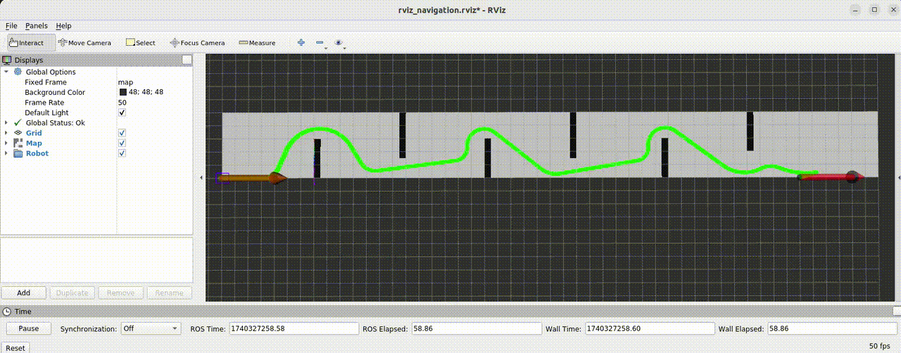
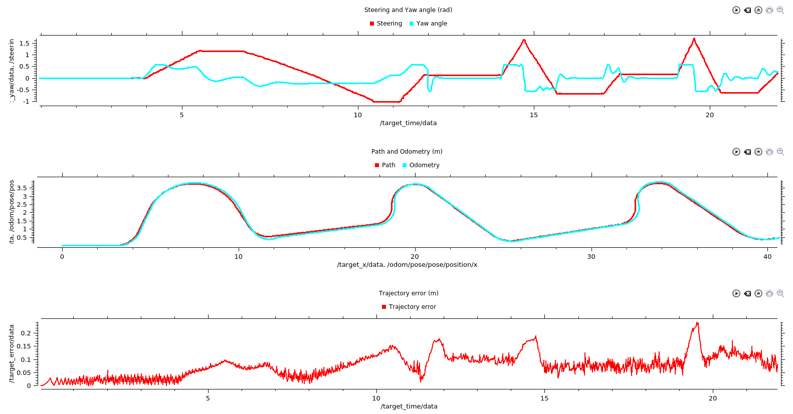

# Autonomous Control and Navigation for Mobile Robots (ACM)
Author: **[Mahmoud Tahmasebi]**

<!-- TOC -->

- [ACM](#ACM)
  - [Robot](#Robot)
  - [Packages](#Packages)
    - [catkin_ws_robot](#catkin_ws_robot)
    - [catkin_ws_sim](#catkin_ws_sim)
    - [catkin_ws_control_cpp_auto](#catkin_ws_control_cpp_auto)
    - [hybrid_a_star_ws](#hybrid_a_star_ws)
    - [catkin_ws_slam](#catkin_ws_slam)
    - [catkin_ws_map](#catkin_ws_map)
    - [catkin_ws_lidar](#catkin_ws_lidar)
  - [Usage](#usage)
  - [Simulation Result](#simulation result)
  - [Practical Usage](#Practical Usage)
  - [Practical Result](#Practical Result)
  - [Todo](#Todo)


<!-- /TOC -->

**ACM** is a ROS-based repository that provides essential packages for controlling and navigating autonomous mobile robots.

This repository includes:
* Motion Planning (Hybrid A*, TEB, MPC)
* Localization & Mapping (AMCL, Costmaps, SLAM)
* Sensor Integration (LiDAR, Cameras, IMU, GPS)
* Path Following & Obstacle Avoidance

Designed for Hunter V2 and adaptable to other robotic platforms, ACM's goal is enabling precise and efficient navigation in real-world environments.

--- 
## Robot
The system is testing on Hunter V2 which is specifically developed to excel in low-speed autonomous driving scenarios. It is equipped with front-wheel Ackerman steering and rocker suspension, enabling it to effectively navigate obstacles encountered on its path.
* User manual (check this direct [link](https://global.agilex.ai/pages/download-manual))


---
### Packages
The provided packages have been tested and verified on ROS Noetic running on Ubuntu 20.04 (Focal Fossa).

## catkin_ws_robot
This package includes the CAN communication interface for the real robot. Please refer to the following repos:

* https://github.com/agilexrobotics/ugv_sdk.git
* https://github.com/agilexrobotics/hunter_ros.git

## catkin_ws_sim
This package includes a simulated robot, allowing for development and testing in a virtual environment before deployment on the real robot.

## catkin_ws_control_cpp_auto
This package provides the Model Predictive Controller (MPC) based on OSQP-Eigen that uses the bicycle model to generate the controlling effort. The current package is also support spline yaw smoother for generating a smooth steering and velocity commands.

For more information and dependencies visit:

* https://github.com/M2219/MPC_BicycleModel
* https://github.com/robotology/osqp-eigen

## hybrid_a_star_ws
This package features a slightly modified Hybrid A Star global planner, adapted from this  (repo [link](https://github.com/zm0612/Hybrid_A_Star/tree/main)). It subscribes to start, goal, and map topics to generate a global, collision-free path with efficient and safe navigation in complex environments.

## catkin_ws_slam
This package serves as the host for SLAM algorithms and currently supports AMCL (Adaptive Monte Carlo Localization) for precise robot localization within a known map. Future updates may incorporate additional SLAM methods for enhanced mapping and navigation.

## catkin_ws_map
This package is responsible for handling the map and generating both local and global costmaps for the local and global planners.

Currently, it takes a static map from the map server and processes it to generate costmaps, which are used for path planning and obstacle avoidance.

## catkin_ws_lidar
This package serves as the host for LiDAR data processing. Currently, it includes a fake LiDAR implementation for simulation purposes, enabling sensor-based testing and development without requiring real hardware. The parameters can be set based on the real LiDAR.

---

## Usage

Clone the repository and catkin_make the packages.

```sh
git clone git@github.com:M2219/ACM.git

cd ACM

cd [catkin workspaces]
catkin_make
```

After building the packages:

terminal 1: 

```sh
roscore
```
terminal 2:
```sh
./launch_all.sh
```

terminal 3:
```sh
cd catkin_ws_control_cpp_auto
source devel/setup.bash
roslaunch custom_teleop mpc_control.launch
```

Note: the initial conditions and parameters can be set in catkin_ws_control_cpp_auto/src/custom_teleop/include/custom_teleop/all_config.hpp.
* If changed the catkin_ws_control_cpp_auto and hybrid_a_star_ws must be rebuilt
* The dynamic reconfiguration will be added soon

---
## Simulation Result
If everything goes well, the following result will be shown in RViz.

<p align="center" style="margin:0">
 
</p>

Note: The robot footprint moves based on AMCL localization (has inaccuracy), while the red arrow follows the odometry published by the simulation (exact odometry).



---
## Practical Usage

For testing on real robot replace "cd catkin_ws_sim" with "cd catkin_ws_robot" in launch_all.sh, and run the following commands.

```sh

terminal 1:
sudo modprobe gs_usb
sudo ip link set can0 up type can bitrate 500000

terminal 2:
./launch_all.sh

terminal 3:
cd catkin_ws_control_cpp_auto
source devel/setup.bash
roslaunch custom_teleop mpc_control.launch
```
---
## Practical Result

---
## Todo

* Develop the global planner to generate a path based on the global costmap.
* Incorporate stereo matching for obstacle detection.
* Integrate a local planner for real-time trajectory adjustment.
* Implement SLAM for mapping and localization.
* Handling of dynamic obstacles.
* ...
