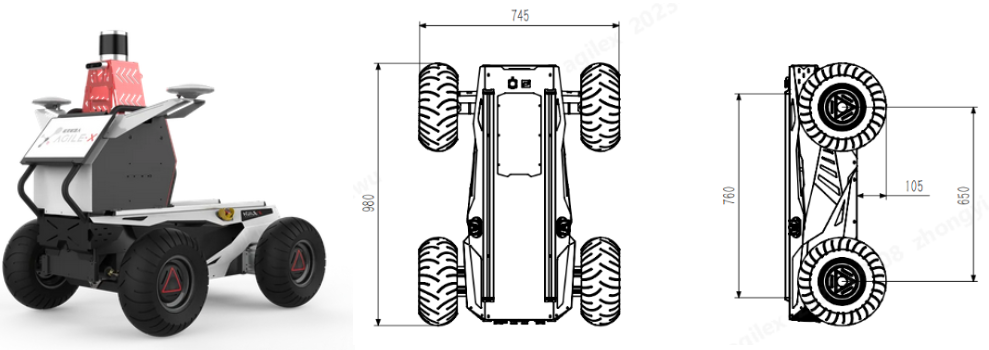

# Autonomous Control and Navigation for Mobile Robots (ACM)
Author: **[Mahmoud Tahmasebi]**

<!-- TOC -->

- [ACM](#ACM)
  - [Robot](#Robot)
  - [Packages](#Packages)
    - [catkin_ws_robot](#catkin_ws_robot)
    - [catkin_ws_sim](#catkin_ws_sim)
    - [catkin_ws_control_cpp_auto](#catkin_ws_control_cpp_auto)
    - [hybrid_a_star_ws](#hybrid_a_star_ws)
    - [catkin_ws_slam](#catkin_ws_slam)
    - [catkin_ws_map](#catkin_ws_map)
    - [catkin_ws_lidar](#catkin_ws_lidar)
  - [Usage](#usage)

<!-- /TOC -->

**ACM** is a ROS-based repository that provides essential packages for controlling and navigating autonomous mobile robots.

This repository includes:
* Motion Planning (Hybrid A*, TEB, MPC)
* Localization & Mapping (AMCL, Costmaps, SLAM)
* Sensor Integration (LiDAR, Cameras, IMU, GPS)
* Path Following & Obstacle Avoidance

Designed for Hunter V2 and adaptable to other robotic platforms, ACM's goal is enabling precise and efficient navigation in real-world environments.

--- 
## Robot
Hunter V2 is specifically developed to excel in low-speed autonomous driving scenarios. It is equipped with front-wheel Ackerman steering and rocker suspension, enabling it to effectively navigate obstacles encountered on its path.
* User manual (check this direct [link](https://global.agilex.ai/pages/download-manual))

