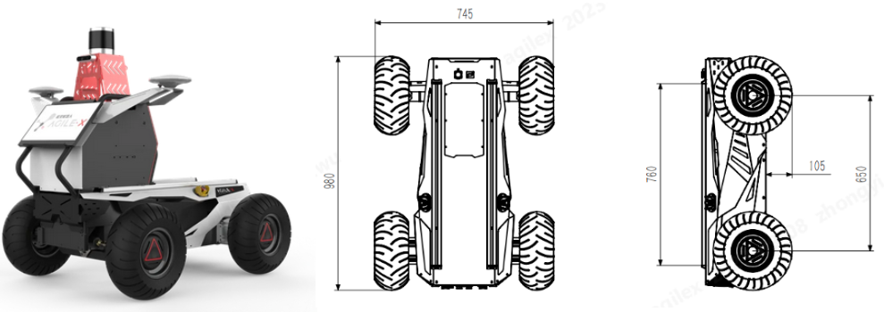
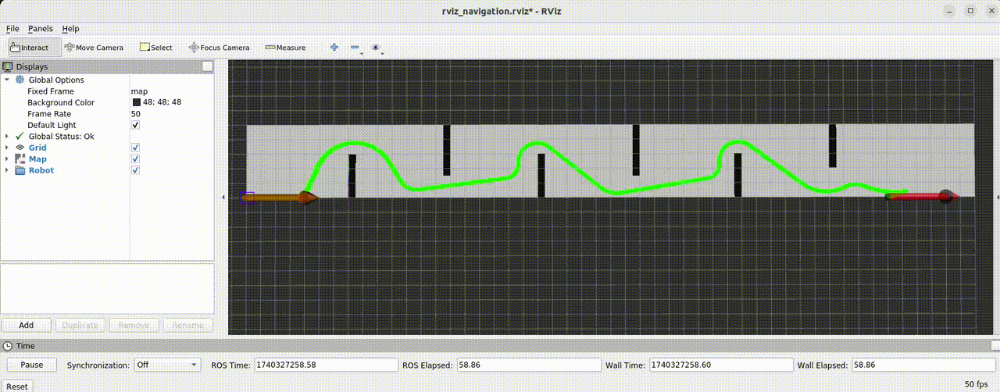
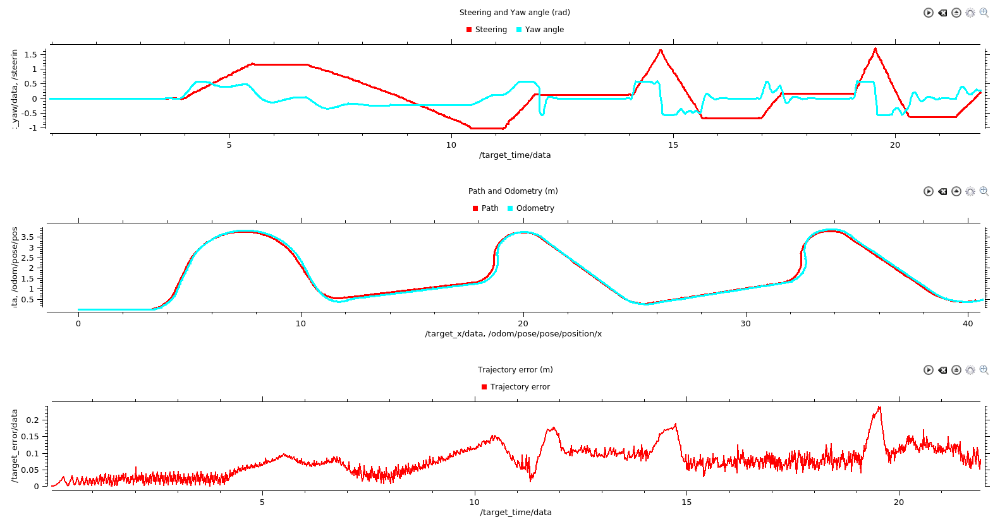

# Autonomous Control and Navigation for Mobile Robots (ACNMR)
Author: **[Mahmoud Tahmasebi]**

This branch is updating based on ROS2 ...

<!-- TOC -->

- [ACM](#ACM)
  - [Robot](#Robot)
  - [Packages](#Packages)
    - [robot_interface](#robot_interface)
    - [simulated_robot](#simulated_robot)
    - [bicycle_controller_ign](#bicycle_controller_ign)
    - [acker_controller_ign](#acker_controller_ign)
    - [mpc_control_cpp_auto](#mpc_control_cpp_auto)
    - [hybrid_a_star_ws](#hybrid_a_star_ws)
    - [slam_sim](#slam_sim)
    - [map_service](#map_service)
    - [lidar_sim](#lidar_sim)
    - [wheel_odometry_gazebo](#wheel_odometry_gazebo)
    - [openvins](#openvins)
    - [imu_localization](#imu_localization)
  - [Usage](#usage)
  - [simulation_result](#simulation_result)
  - [practical_usage](#practical_usage)
  - [practical_result](#practical_result)
  - [Todo](#Todo)


<!-- /TOC -->

**ACNMR** is a ROS-based repository that provides essential packages for controlling and navigating autonomous mobile robots (Hunter V2).

This repository includes:
* Motion Planning (Hybrid A*, TEB, MPC)
* Localization & Mapping (AMCL, Costmaps, SLAM)
* Sensor Integration (LiDAR, Cameras, IMU, GPS)
* Path Following & Obstacle Avoidance

Designed for Hunter V2 and adaptable to other robotic platforms, ACNMR's goal is enabling precise and efficient navigation in real-world environments.

(Supported by Atlantic Technological University (Sligo), Robotic Lab.)

--- 
## Robot
The system is being tested on Hunter V2 which is specifically developed to excel in low-speed autonomous driving scenarios. It is equipped with front-wheel Ackerman steering and rocker suspension, enabling it to effectively navigate obstacles encountered on its path.
* User manual (check this direct [link](https://global.agilex.ai/pages/download-manual))


---
### Packages
The provided packages have been tested and verified on ROS2 Humble running on Ubuntu 22.04 (Jammy).

## robot_interface
This package includes the CAN communication interface for the real robot. Please refer to the following repos:

* https://github.com/agilexrobotics/ugv_sdk.git
* https://github.com/agilexrobotics/hunter_ros2.git

This package also provides wheel encoder odoemtry.

## simulated_robot
This package includes a simulated robot, allowing for development and testing in a virtual environment before deployment on the real robot.

## bicycle_controller_ign
Gazebo bicycle model simulation. The following simulation supports gazebo fortress (ignition). 
Sensors: IMU

## acker_controller_ign
Gazebo ackermann model simulation. The following simulation supports gazebo fortress (ignition).
Sensors: IMU
## mpc_control_cpp_auto
This package provides the Model Predictive Controller (MPC) based on OSQP-Eigen that uses the bicycle model to generate the controlling effort. The current package is also support spline yaw smoother for generating a smooth steering and velocity commands.

For more information and dependencies visit:

* https://github.com/M2219/MPC_BicycleModel
* https://github.com/robotology/osqp-eigen

## hybrid_a_star_ws
This package features a slightly modified Hybrid A Star global planner, adapted from this  (repo [link](https://github.com/zm0612/Hybrid_A_Star/tree/main)). It subscribes to start, goal, and map topics to generate a global, collision-free path with efficient and safe navigation in complex environments.

## slam_sim
This package serves as the host for SLAM algorithms and currently supports AMCL (Adaptive Monte Carlo Localization) for precise robot localization within a known map. Future updates may incorporate additional SLAM methods for enhanced mapping and navigation.

## map_service
This package is responsible for handling the map and generating both local and global costmaps for the local and global planners.

Currently, it takes a static map from the map server and processes it to generate costmaps, which are used for path planning and obstacle avoidance.

## lidar_sim
This package serves as the host for LiDAR data processing. Currently, it includes a fake LiDAR implementation for simulation purposes, enabling sensor-based testing and development without requiring real hardware. The parameters can be set based on the real LiDAR.

## wheel_odometry_gazebo
This package pubishes wheel odometry based on gazebo simulation.

## openvins
This package aims to generates map and trajectory using openvins visual-inertial.

## imu_localization
This package provides /odometry/filtered by fusing IMU and wheel encoder odometry.

---

## Usage

Clone the repository and  the packages.

```sh
git clone git@github.com:M2219/ACNMR.git

cd ACNMR

cd [catkin workspaces]

colcon build --symlink-install 
source install/setup.bash

```

After building the packages:

```sh
terminal 1:
./launch_all_simulation.sh

terminal 2:
cd mpc_control_cpp_auto
source install/setup.bash
ros2 launch custom_teleop mpc_launch.launch.xml
```

Note: the initial conditions and parameters can be set in mpc_control_cpp_auto/src/custom_teleop/include/custom_teleop/all_config.hpp.
* If changed the mpc_control_cpp_auto and hybrid_a_star_ws must be rebuilt
* The dynamic reconfiguration will be added soon

---
## simulation_result
If everything goes well, the following result will be shown in RViz.

<p align="center" style="margin:0">
 
</p>



---
## practical_usage

For testing on the real robot (Hunter V2) run the following commands.

```sh

terminal 1:
sudo modprobe gs_usb
sudo ip link set can0 up type can bitrate 500000

terminal 2:
./launch_all_robot.sh

terminal 3:
cd mpc_control_cpp_auto
source install/setup.bash
ros2 launch custom_teleop mpc_launch.launch.xml
```
---
## practical_result

---
## Todo

* Develop the global planner to generate a path based on the global costmap.
* Incorporate stereo matching for obstacle detection.
* Integrate a local planner for real-time trajectory adjustment.
* Implement SLAM for mapping and localization.
* Handling of dynamic obstacles.
* ...
